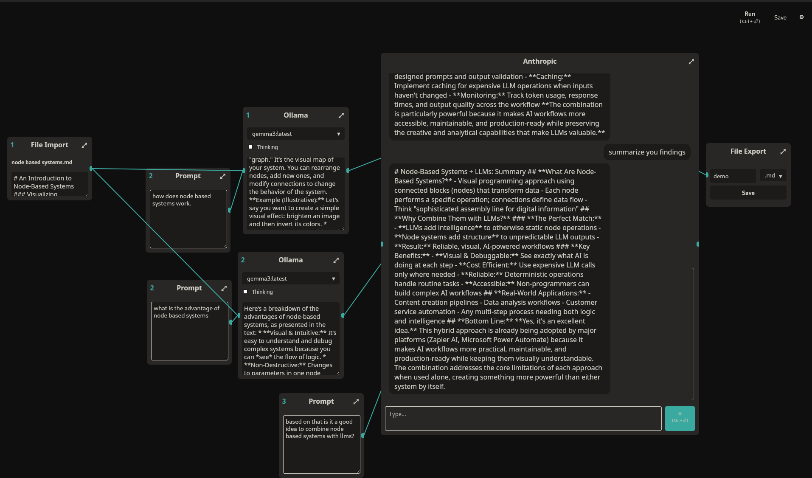

# Mosaik

Mosaik is an experimental node based ui for llms. 



## Get Started 

Ensure you have [Rust](https://www.rust-lang.org/tools/install) installed.

use [Dioxus CLI](https://github.com/DioxusLabs/dioxus/tree/master/packages/cli) to build and serve:
```sh
cargo install dioxus-cli
```
to serve run
```sh
dx serve
```
to build run
```sh
dx build
```

## About

Mosaik is an experimental node-based interface for interacting with LLMs beyond traditional chat. I am exploring new ways to work with AI and would love your feedback.

### LLM Providers
- [x] Ollama integration
- [x] Anthropic integration
- [ ] OpenAI integration
- [ ] Google integration

### File Support
- [x] Import files (txt, md)
- [x] Save files (txt, md)

### Interaction Methods
You can chat with LLMs individually through separate nodes, or connect multiple nodes together to create automated workflows that run in sequence.
